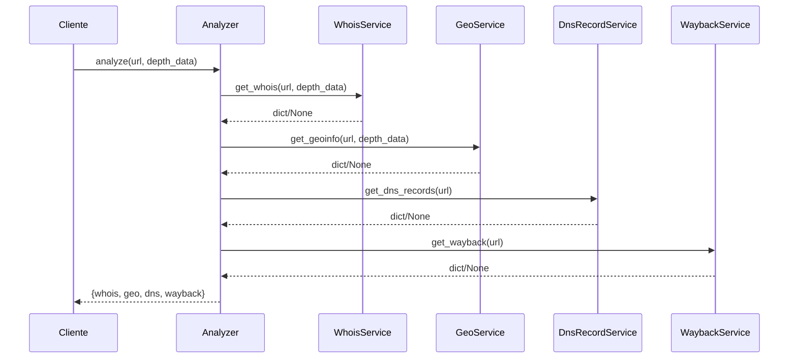
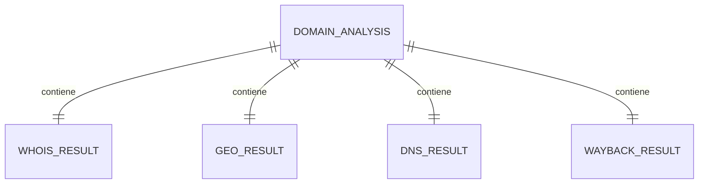

# 1) Título del Proyecto

# **Spynet** — Analizador modular de metadatos de dominios web

**Descripción general.** Spynet, en el estado actual de este repositorio, es un analizador en Python que centraliza consultas de **WHOIS**, **DNS**, **geolocalización/IP** y **Wayback Machine** para un dominio/URL, y devuelve un resultado agregado en una sola estructura de datos.  
**Propósito académico.** Sirve como base de la primera entrega de Ingeniería de Software para modelar requerimientos, diseño por servicios y patrón Facade.  
**Problema que resuelve.** Evita consultar múltiples fuentes manualmente para obtener metadatos técnicos de un sitio.  
**Contexto de uso.** Laboratorio/prototipo técnico para explorar inteligencia web y discutir arquitectura orientada a servicios pequeños.

> Nota de alcance: el README previo menciona Django/REST/BD, pero **ese stack no está implementado en este repositorio actual**. El código real presente es un núcleo Python con servicios de consulta externa.

---

# 2) Resumen Ejecutivo del Proyecto

Spynet toma una URL (ejemplo: `google.com`) y ejecuta cuatro análisis:

1. **WHOIS**: registrador, titular, fechas y edad del dominio.
2. **Geo/IP**: país, ciudad, ISP, organización, IP y coordenadas.
3. **DNS**: registros A, AAAA, CNAME, NS y MX.
4. **Wayback**: número de snapshots y últimos 5 snapshots.

Luego retorna un único diccionario con las cuatro secciones.

**Usuarios potenciales:** estudiantes, docentes, analistas básicos de infraestructura web.  
**Tecnologías núcleo:** Python + `python-whois` + `requests` + `dnspython`.  
**Primera fase entregada (evidencia):** definición de requisitos/historias y mapeo de historias en Workshop-1, más implementación inicial de servicios backend Python.

---

# 3) Estructura General del Repositorio

```text
/workspace/spynet
├── analyzer.py
├── requirements.txt
├── README.md
├── README_UML_CLASES.md
├── services/
│   ├── __init__.py
│   ├── dns_service.py
│   ├── geo_service.py
│   ├── wayback_service.py
│   └── whois_service.py
├── Workshop-1/
│   ├── README.md
│   ├── spynet_workshop_1.pdf
│   └── spynet_workshop_1_correccion.pdf
└── img/
    ├── spynet_logo.png
    ├── spynet_penguins.png
    ├── tux_spynet_profesional.png
    └── txt.txt
```

| Carpeta / Archivo | Propósito | Importancia para el proyecto |
|---|---|---|
| `analyzer.py` | Fachada (Facade) que orquesta servicios | Es el punto de entrada funcional actual |
| `services/` | Servicios desacoplados por responsabilidad | Materializa separación de responsabilidades |
| `requirements.txt` | Dependencias Python | Permite ejecutar el prototipo |
| `Workshop-1/` | Documentos académicos (requisitos e historias) | Contexto formal de primera entrega |
| `README_UML_CLASES.md` | UML de clases en PlantUML | Ayuda para defensa oral y diseño |
| `img/` | Recursos visuales | Soporte de presentación/documentación |

---

# 4) Tecnologías, Lenguajes y Librerías Utilizadas

## Lenguaje principal
- **Python**: implementación de clases de servicio y composición.

## Librerías de dependencias (`requirements.txt`)

| Tecnología / Librería | Uso dentro del proyecto | Archivos relacionados | Explicación para el quiz |
|---|---|---|---|
| `python-whois` | Parseo WHOIS + `extract_domain()` | `services/whois_service.py`, `services/dns_service.py`, `services/geo_service.py`, `services/wayback_service.py` | Normaliza entrada URL y consulta registros de dominio |
| `requests` | Llamadas HTTP a APIs externas | `services/geo_service.py`, `services/wayback_service.py` | Encapsula integración con servicios de terceros |
| `dnspython` (`dns.resolver`) | Resolución de registros DNS | `services/dns_service.py` | Permite detectar infraestructura DNS de forma programática |

## APIs externas usadas
- **IP-API** (`http://ip-api.com/json/`): geolocalización e información de red.
- **Wayback CDX API** (`http://web.archive.org/cdx/search/cdx`): historial de snapshots.

## Configuración y build
- No hay `package.json`, `pom.xml`, `build.gradle`, `composer.json` ni archivos `.env` en el estado actual.
- La configuración operativa principal son endpoints hardcodeados en servicios (`GeoService`, `WaybackService`).

---

# 5) Arquitectura del Proyecto

## Tipo de arquitectura observada
Arquitectura **modular por servicios** con una **fachada** (`Analyzer`) que delega consultas a componentes especializados.

## Separación de responsabilidades
- `Analyzer`: coordinación.
- `WhoisService`: dominio/registro.
- `DnsRecordService`: DNS.
- `GeoService`: ubicación/red.
- `WaybackService`: histórico web.

## Comunicación
Sin mensajería interna ni capa de persistencia: comunicación directa por llamadas de método y retorno de diccionarios Python.

```mermaid
flowchart TD
    U[Usuario o script] --> A[Analyzer.analyze(url, depth_data)]
    A --> W[WhoisService.get_whois]
    A --> D[DnsRecordService.get_dns_records]
    A --> G[GeoService.get_geoinfo]
    A --> B[WaybackService.get_wayback]
    W --> R1[Dict WHOIS]
    D --> R2[Dict DNS]
    G --> R3[Dict GEO]
    B --> R4[Dict Wayback]
    R1 --> O[Respuesta agregada]
    R2 --> O
    R3 --> O
    R4 --> O
```

---

# 6) Explicación Detallada del Flujo del Sistema

1. Se recibe `url` y flag `depth_data` en `Analyzer.analyze`.
2. Se invoca `WhoisService.get_whois(url, depth_data)`.
3. Se invoca `GeoService.get_geoinfo(url, depth_data)`.
4. Se invoca `DnsRecordService.get_dns_records(url)`.
5. Se invoca `WaybackService.get_wayback(url)`.
6. Se agregan resultados en un único diccionario con claves `whois`, `geo`, `dns`, `wayback`.
7. Si hay errores en servicios, cada uno puede devolver `None` (estrategia tolerante a fallos parciales).



---

# 7) Análisis de Clases

## Clase: `Analyzer`
Archivo: `analyzer.py`

### Propósito
Aplicar patrón **Facade** para ocultar complejidad de múltiples servicios.

### Atributos / Propiedades
| Propiedad | Tipo | Descripción |
|---|---|---|
| `whois` | `WhoisService` | Servicio WHOIS |
| `dns` | `DnsRecordService` | Servicio DNS |
| `geo` | `GeoService` | Servicio de geolocalización |
| `wayback` | `WaybackService` | Servicio de snapshots históricos |

### Métodos
| Método | Parámetros | Retorna | Explicación |
|---|---|---|---|
| `__init__` | — | `None` | Instancia y compone los 4 servicios |
| `analyze` | `url`, `depth_data=False` | `dict` | Orquesta y agrega respuestas |

### Relación con otras clases
Composición directa de cuatro servicios.

### Explicación oral sugerida
“`Analyzer` es la puerta única de consulta: recibe una URL y coordina los servicios especializados para devolver un resultado consolidado.”

## Clase: `WhoisService`
Archivo: `services/whois_service.py`

### Propósito
Consultar WHOIS, normalizar fechas y calcular edad de dominio.

### Atributos / Propiedades
No define atributos persistentes propios.

### Métodos
| Método | Parámetros | Retorna | Explicación |
|---|---|---|---|
| `get_whois` | `url: str`, `all_data=False` | `dict` o `None` | Consulta WHOIS, calcula `domain_age_years`, y retorna versión resumida o completa |

### Relación con otras clases
Utilizada por `Analyzer`; depende de `whois` y `datetime`.

### Explicación oral sugerida
“Extrae el dominio, consulta WHOIS y transforma datos crudos en campos útiles para análisis académico.”

## Clase: `DnsRecordService`
Archivo: `services/dns_service.py`

### Propósito
Resolver registros DNS comunes.

### Métodos
| Método | Parámetros | Retorna | Explicación |
|---|---|---|---|
| `get_dns_records` | `url: str` | `dict` o `None` | Intenta A/AAAA/CNAME/NS/MX y omite errores por tipo |

### Relación
Usada por `Analyzer`; usa `dns.resolver` y `extract_domain`.

## Clase: `GeoService`
Archivo: `services/geo_service.py`

### Propósito
Consumir IP-API y mapear respuesta de red/geolocalización.

### Atributos
| Propiedad | Tipo | Descripción |
|---|---|---|
| `api_endpoint` | `str` | Endpoint base (`http://ip-api.com/json/`) |

### Métodos
| Método | Parámetros | Retorna | Explicación |
|---|---|---|---|
| `__init__` | — | `None` | Configura endpoint |
| `get_geoinfo` | `url`, `all_data=False` | `dict` o `None` | Consulta API y retorna datos resumidos o completos |

## Clase: `WaybackService`
Archivo: `services/wayback_service.py`

### Propósito
Consultar volumen histórico y snapshots recientes en Wayback.

### Atributos
| Propiedad | Tipo | Descripción |
|---|---|---|
| `cdx_api` | `str` | Endpoint CDX |
| `headers` | `dict` | User-Agent para solicitudes |

### Métodos
| Método | Parámetros | Retorna | Explicación |
|---|---|---|---|
| `get_count` | `domain: str` | `int` | Obtiene número de páginas/snapshots vía CDX |
| `get_snapshots` | `domain: str` | `list` | Obtiene hasta 5 snapshots con URL archivada |
| `get_wayback` | `url: str` | `dict` o `None` | Integra conteo y snapshots |

---

# 8) Análisis de Funciones y Métodos

| Archivo | Función / Método | Parámetros | Retorna | Explicación detallada | Importancia |
|---|---|---|---|---|---|
| `analyzer.py` | `analyze` | `url`, `depth_data=False` | `dict` | Ejecuta cuatro servicios y agrega salida | Punto de integración |
| `services/whois_service.py` | `get_whois` | `url`, `all_data=False` | `dict/None` | Consulta WHOIS, normaliza fechas, calcula antigüedad | Núcleo de metadatos legales/temporales |
| `services/dns_service.py` | `get_dns_records` | `url` | `dict/None` | Resuelve tipos DNS con tolerancia por tipo fallido | Describe infraestructura de resolución |
| `services/geo_service.py` | `get_geoinfo` | `url`, `all_data=False` | `dict/None` | Llama IP-API y filtra campos clave | Contexto geográfico y de proveedor |
| `services/wayback_service.py` | `get_count` | `domain` | `int` | Consume CDX con `showNumPages` | Métrica de historial |
| `services/wayback_service.py` | `get_snapshots` | `domain` | `list` | Trae últimos snapshots deduplicados | Evidencia histórica navegable |
| `services/wayback_service.py` | `get_wayback` | `url` | `dict/None` | Coordina conteo y snapshots | Completa análisis temporal |

---

# 9) Explicación por Bloques de Archivos Importantes

## Archivo: `analyzer.py`

| Líneas (aprox.) | Bloque | Explicación |
|---|---|---|
| 1-4 | Imports de servicios | Define dependencias de fachada |
| 6-12 | Clase + `__init__` | Composición de servicios (baja duplicación) |
| 14-21 | `analyze` | Orquestación central y contrato de salida |
| 24 | `print(Analyzer().analyze(...))` | Ejecución de prueba manual desde script |

## Archivo: `services/whois_service.py`

| Líneas | Bloque | Explicación |
|---|---|---|
| 1-2 | Imports | Fecha/huso y librería WHOIS |
| 4-30 | `get_whois` | Extracción de dominio, consulta, normalización de listas/fechas, cálculo de edad, salida resumida/completa |
| 31-39 | Comentarios de prueba | Casos de prueba manual y manejo de error implícito |

## Archivo: `services/dns_service.py`

| Líneas | Bloque | Explicación |
|---|---|---|
| 1-2 | Imports | Resolver DNS y extracción de dominio |
| 4-23 | `get_dns_records` | Inicializa dict por tipo, itera y captura errores por consulta |

## Archivo: `services/geo_service.py`

| Líneas | Bloque | Explicación |
|---|---|---|
| 1-2 | Imports | HTTP y utilidades dominio |
| 4-7 | `__init__` | Endpoint de API |
| 9-30 | `get_geoinfo` | Llamada API, validación `status`, salida resumida/completa |

## Archivo: `services/wayback_service.py`

| Líneas | Bloque | Explicación |
|---|---|---|
| 1-10 | Configuración | Endpoint CDX + headers |
| 12-23 | `get_count` | Consulta total de páginas |
| 26-51 | `get_snapshots` | Consulta snapshots limitados y mapeo a URL de archivo |
| 54-64 | `get_wayback` | Integración y manejo de excepción |

---

# 10) Modelo de Datos y Entidad-Relación

No existe una base de datos persistente implementada en el código actual. El sistema trabaja con **entidades lógicas en memoria** (diccionarios JSON-like).

| Entidad lógica | Atributos | Descripción | Relaciones |
|---|---|---|---|
| `WhoisResult` | `registrar`, `registrant`, `creation_date`, `expiration_date`, `domain_age_years` | Metadatos registrales del dominio | 1 a 1 con `DomainAnalysis` |
| `GeoResult` | `country`, `city`, `isp`, `org`, `ip`, `lat`, `lon` | Contexto de red/geográfico | 1 a 1 con `DomainAnalysis` |
| `DnsResult` | `A`, `AAAA`, `CNAME`, `NS`, `MX` | Infraestructura DNS | 1 a 1 con `DomainAnalysis` |
| `WaybackResult` | `snapshot_count`, `snapshots[]` | Histórico web | 1 a 1 con `DomainAnalysis` |
| `DomainAnalysis` | `whois`, `geo`, `dns`, `wayback` | Agregado final retornado por fachada | Agrega cuatro subentidades |



---

# 11) Endpoints, Rutas o Pantallas

En este repositorio no hay servidor HTTP ni frontend implementado; no existen endpoints REST funcionales.

| Ruta / Pantalla | Método | Archivo relacionado | Función ejecutada | Descripción |
|---|---|---|---|---|
| N/A | N/A | `analyzer.py` | `Analyzer.analyze` | El consumo actual es por script Python |

---

# 12) Reglas de Negocio

| Regla de negocio | Archivo donde aparece | Explicación | Impacto |
|---|---|---|---|
| Si `all_data=True`, retornar payload completo | `whois_service.py`, `geo_service.py` | Habilita modo detallado para diagnóstico | Flexibilidad analítica |
| Si falla un query DNS por tipo, continuar | `dns_service.py` | No abortar por falta de un registro específico | Robustez parcial |
| Si IP-API responde `status=fail`, retornar `None` | `geo_service.py` | Evita propagar datos inválidos | Integridad mínima |
| Edad de dominio calculada desde `creation_date` | `whois_service.py` | Métrica temporal útil (RF-06) | Valor interpretativo |
| Manejo genérico de excepción y `None` | Todos los servicios | Estrategia fail-soft | Reduce caídas globales |

---

# 13) Principios de Ingeniería de Software Aplicados

- **Modularidad:** cada tipo de análisis vive en su archivo de servicio.
- **Separación de responsabilidades:** fachada coordina; servicios ejecutan lógica específica.
- **Abstracción:** consumidor usa `analyze()` sin conocer APIs externas.
- **Cohesión:** cada clase tiene propósito único claro.
- **Acoplamiento:** moderado (fachada depende de clases concretas; podría inyectarse interfaz en futuro).
- **Reutilización:** servicios son reutilizables por separado.
- **Mantenibilidad:** estructura simple favorece lectura y extensión.
- **Escalabilidad (potencial):** se pueden agregar nuevos servicios al Facade.

---

# 14) 30+ Preguntas de Quiz y Respuestas

| Pregunta posible | Respuesta recomendada |
|---|---|
| 1. ¿Qué hace Spynet hoy? | Agrega análisis WHOIS, DNS, GEO y Wayback para una URL en un solo diccionario. |
| 2. ¿Cuál es la clase principal? | `Analyzer` en `analyzer.py`. |
| 3. ¿Qué patrón aplica `Analyzer`? | Facade. |
| 4. ¿Qué servicio calcula edad del dominio? | `WhoisService`. |
| 5. ¿Cómo se obtiene el dominio desde URL? | Con `extract_domain()` de `python-whois`. |
| 6. ¿Qué registros DNS se consultan? | A, AAAA, CNAME, NS y MX. |
| 7. ¿Qué pasa si un tipo DNS falla? | Se ignora ese tipo y continúa. |
| 8. ¿Qué API usa geolocalización? | IP-API (`ip-api.com`). |
| 9. ¿Qué API usa historial web? | CDX de Wayback Machine. |
| 10. ¿Dónde están las dependencias? | `requirements.txt`. |
| 11. ¿Hay base de datos implementada? | No en el código actual. |
| 12. ¿Hay backend REST implementado? | No en este estado del repo. |
| 13. ¿Qué retorna `analyze`? | Un dict con llaves `whois`, `geo`, `dns`, `wayback`. |
| 14. ¿Qué significa `depth_data`? | Activa salida detallada en WHOIS/GEO. |
| 15. ¿Qué riesgo tiene Wayback? | Puede ser más lento (comentario en `analyzer.py`). |
| 16. ¿Cómo maneja errores WhoisService? | `try/except` global y retorna `None`. |
| 17. ¿Qué mejora de diseño propondrías? | Inyección de dependencias e interfaces de servicio. |
| 18. ¿Qué mejora de confiabilidad? | Timeouts/reintentos consistentes en todos servicios. |
| 19. ¿Qué mejora de observabilidad? | Logging estructurado en vez de silencios por excepción. |
| 20. ¿Qué mejora de arquitectura futura? | Exponer `Analyzer` mediante API REST. |
| 21. ¿Qué concepto de cohesión se observa? | Métodos de cada servicio enfocados en un dominio técnico. |
| 22. ¿Qué acoplamiento existe? | `Analyzer` crea dependencias concretas internamente. |
| 23. ¿Cómo se prueba rápidamente? | Ejecutando `python analyzer.py`. |
| 24. ¿Qué entrega académica acompaña el código? | Workshop-1 con RF/RNF y user stories. |
| 25. ¿Qué salida tiene Wayback? | `snapshot_count` y lista `snapshots`. |
| 26. ¿Qué contiene cada snapshot? | `timestamp` y URL archivada. |
| 27. ¿Qué formato de datos domina? | Diccionarios Python serializables a JSON. |
| 28. ¿Qué principio de robustez aplica DNS? | Tolerancia a fallos parciales. |
| 29. ¿Qué limita la precisión GEO? | Dependencia de proveedor externo y disponibilidad. |
| 30. ¿Qué se logró en primera entrega? | Núcleo funcional de análisis + artefactos de requisitos. |

---

# 15) Guion Oral (3–5 minutos)

“Spynet es un prototipo de análisis de dominios que consolida cuatro fuentes técnicas: WHOIS, DNS, geolocalización e historial de Wayback. Arquitectónicamente aplicamos un patrón Facade en la clase `Analyzer`, que oculta la complejidad de servicios especializados. Cada servicio está desacoplado por responsabilidad: `WhoisService` para metadatos registrales y edad del dominio; `DnsRecordService` para infraestructura DNS; `GeoService` para contexto de red e IP; y `WaybackService` para evidencia histórica. El flujo inicia cuando se recibe una URL, se normaliza el dominio y se consulta cada proveedor externo. El sistema retorna un diccionario unificado, tolerando fallos parciales mediante retornos `None`. En términos de Ingeniería de Software, se evidencia modularidad, cohesión y separación de responsabilidades. Como mejora para siguientes entregas, proponemos agregar persistencia, API REST, pruebas automatizadas y manejo de errores más fino con logging y tipado formal.”

---

# 16) Glosario Técnico

| Término | Explicación |
|---|---|
| Clase | Plantilla que define atributos y métodos (`Analyzer`, `GeoService`, etc.) |
| Objeto | Instancia concreta de una clase |
| Método | Función definida dentro de una clase |
| Función | Bloque reutilizable de lógica |
| Propiedad | Atributo de instancia (ej. `api_endpoint`) |
| Entidad | Estructura conceptual de datos de dominio |
| Relación | Vinculación entre entidades (agregación en `DomainAnalysis`) |
| API | Interfaz de servicios externos consumidos por HTTP |
| Librería | Paquete reutilizable (`requests`, `dnspython`) |
| JSON | Formato estructurado de intercambio de datos |
| Dependencia | Paquete externo necesario para ejecutar |
| Facade | Patrón que ofrece punto único de acceso a subsistemas |
| Cohesión | Grado en que un módulo se enfoca en una responsabilidad |
| Acoplamiento | Nivel de dependencia entre módulos |

---

# 17) Mejoras Recomendadas

| Área | Mejora recomendada | Justificación | Prioridad |
|---|---|---|---|
| Código | Reemplazar `except Exception` por excepciones específicas | Mejora diagnósticos y seguridad | Alta |
| Arquitectura | Inyección de dependencias en `Analyzer` | Reduce acoplamiento y facilita tests | Alta |
| Documentación | Docstrings tipadas + contratos de retorno | Facilita mantenimiento y evaluación oral | Alta |
| Base de datos | Persistir resultados en SQLite/PostgreSQL | Habilita histórico local y comparativas | Media |
| Interfaz | Crear CLI o API REST de consulta | Mejora usabilidad real del prototipo | Media |
| Pruebas | Suite con `pytest` y mocks de APIs | Control de regresiones | Alta |
| Seguridad | Timeouts/retries/circuit breaker en todas llamadas externas | Resiliencia ante fallas de red | Alta |

---

# 18) Cómo Ejecutar el Proyecto

## Requisitos previos
- Python 3.10+ recomendado.
- Conectividad a internet (consultas WHOIS, DNS HTTP y Wayback).

## Instalación
```bash
python -m venv .venv
source .venv/bin/activate
pip install -r requirements.txt
```

## Ejecución
```bash
python analyzer.py
```

## Validación básica
- Debe imprimir un diccionario con claves `whois`, `geo`, `dns`, `wayback`.

## Problemas comunes
- Respuestas `None` por rate limits o fallos temporales de APIs externas.
- Variabilidad de datos WHOIS según TLD/proveedor.

---

# 19) Comandos Útiles

```bash
# instalar dependencias
pip install -r requirements.txt

# ejecutar análisis demo
python analyzer.py

# revisar archivos del repo
rg --files

# ver estado git
git status

# registrar cambios
git add README.md && git commit -m "docs: reemplaza README con guía académica completa"
```

---

# 20) Conclusión Académica

En esta primera entrega, el repositorio evidencia un **núcleo funcional modular** para análisis técnico de dominios, con una arquitectura simple y defendible en términos de **separación de responsabilidades** y **patrón Facade**. Aunque todavía no hay persistencia ni API REST implementadas en el código actual, la base permite evolucionar hacia una plataforma más completa. Desde la perspectiva de Ingeniería de Software, se observan decisiones útiles para discutir diseño, integración de terceros, robustez parcial y oportunidades claras de mejora para próximas iteraciones.

---

## Anexos

### A) Relación con artefactos académicos
- `Workshop-1/README.md` referencia requisitos funcionales/no funcionales, historias de usuario y story mapping en PDF.

### B) UML disponible
- `README_UML_CLASES.md` contiene diagrama PlantUML de clases alineado al estado del código.

### C) Archivos analizados para este README
- `README.md` (versión previa)
- `analyzer.py`
- `services/__init__.py`
- `services/dns_service.py`
- `services/geo_service.py`
- `services/whois_service.py`
- `services/wayback_service.py`
- `requirements.txt`
- `Workshop-1/README.md`
- `README_UML_CLASES.md`

### D) Partes no documentables por falta de evidencia de código
- Backend Django/DRF, base de datos relacional y endpoints REST: mencionados en README previo, **no presentes** en implementación actual del repositorio.
