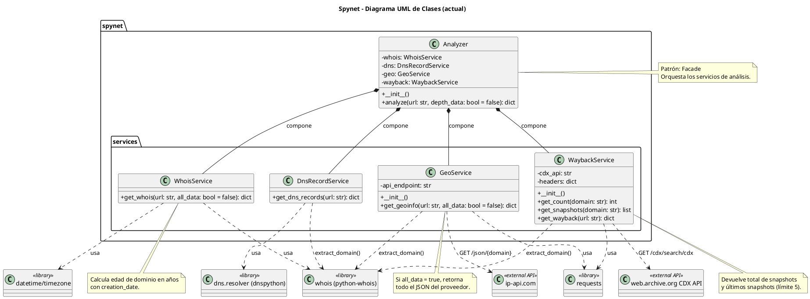

# Diagrama UML de Clases — Spynet (estado actual del repositorio)

Este archivo está listo para **copiar y pegar** en un generador compatible con **PlantUML** (por ejemplo, Lucidchart usando importación de texto/PlantUML).

## Código UML (copia desde `@startuml` hasta `@enduml`)

## Cobertura incluida en este diagrama

- Clases implementadas actualmente en el código Python.
- Atributos y métodos públicos/privados observables en el repositorio.
- Dependencias de librerías (`python-whois`, `requests`, `dnspython`).
- Dependencias de APIs externas (IP-API y Wayback CDX API).
- Relaciones de composición y uso.

## Sugerencia de uso en Lucidchart

1. Crear un diagrama nuevo.
2. Usar la opción de importar/pegar PlantUML (si está habilitada en tu plan/integración).
3. Pegar exactamente el bloque entre `@startuml` y `@enduml`.
4. Ajustar estilo visual (colores, fuentes y distribución) sin cambiar estructura.
